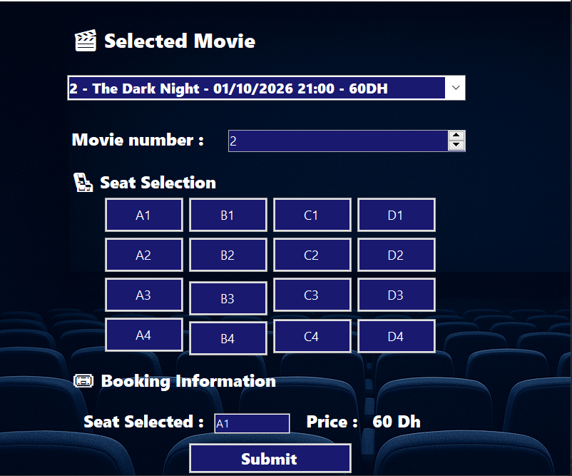
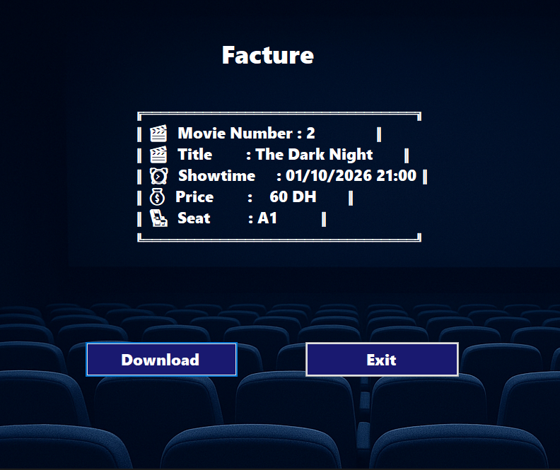

# Cinema Booking System 🎟️

**Cinema Booking system** is a Windows Forms application built in C# that allows users to select movies, choose seats, and generate a ticket with all the relevant details. The application also allows saving the ticket information to a text file.

---

## 🖼 Screenshots

| Movie Selection (Form1) | Ticket Details (Form2) |
|------------------------|-----------------------------|
|  |  |  
---
## Features ✨

- Browse a list of available movies with showtimes and prices.
- Select the number of tickets and seat information.
- Display a detailed ticket with icons for movie, showtime, price, and seat.
- Save the ticket as a `.txt` file for printing or record-keeping.
- User-friendly graphical interface using Windows Forms.

---

## Classes and Structure 🏗️

### 1. **Movies**
Represents a movie with the following properties:
- `number`: Movie ID
- `title`: Movie title
- `showtime`: Date and time of the movie
- `price`: Ticket price

Methods:
- `DisplayInfo()`: Returns a formatted string with movie information.
- `ToString()`: Displays a simple overview for use in dropdowns or lists.

---

### 2. **Ticket**
Inherits from `Movies` and adds:
- `Seat`: User-selected seat number

Overrides `DisplayInfo()` to include:
- 🎬 Movie Number & Title  
- ⏰ Showtime  
- 💰 Price  
- 💺 Seat  

---
## How It Works ⚙️

1. On **Form1**, the user selects a movie numeric selector.
2. Enter the seat number in the text box.
3. Click **Submit**, which opens **Form2** and shows the ticket.
4. In **Form2**, the user can save the ticket to a text file using a **SaveFileDialog**.
5. The application exits cleanly with a dedicated button.

---

## 👨‍💻 Author

Developed with ❤️ by **Marwan El Yassini**

